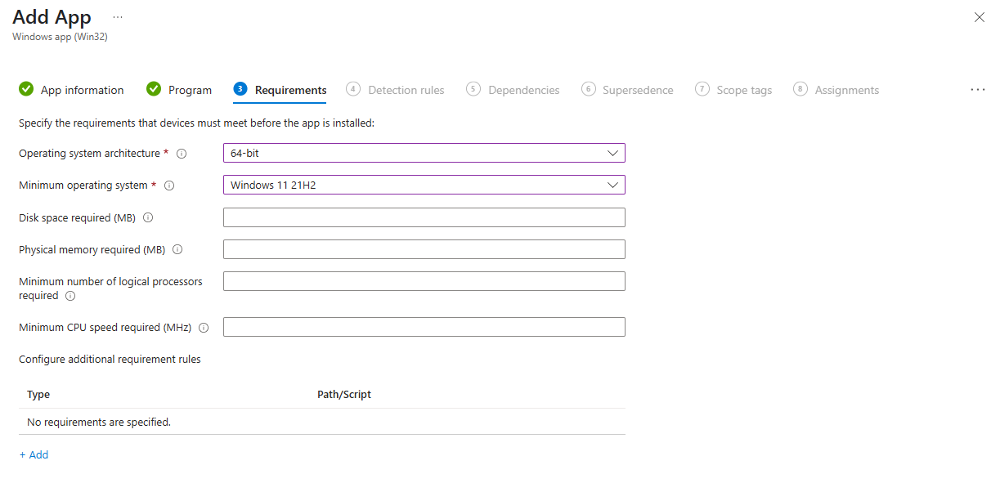
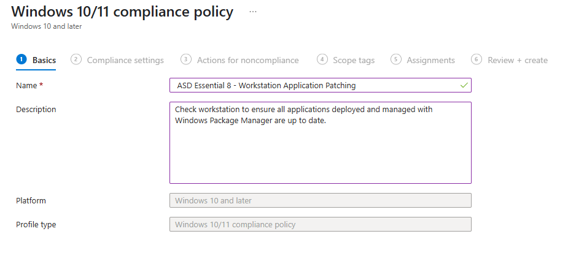

# Intune + Windows Package Manager: Automated App Deployment, Updates, and Compliance

This repository provides a complete solution for managing Windows application deployment, automated updates, and compliance reporting using Microsoft Intune and Windows Package Manager (WinGet).

This solution helps simplify application lifecycle management and helps meet the ASD Essential 8's application patching requirements by:

- Automating deployment and updates of applications.
- Providing visibility and compliance reporting on patch status.
- Enabling rapid response to vulnerabilities through Intune and Windows Package Manager integration.

---

**Table of Contents**

- [Intune + Windows Package Manager: Automated App Deployment, Updates, and Compliance](#intune--windows-package-manager-automated-app-deployment-updates-and-compliance)
  - [1. Deploying Windows Package Manager Applications with Intune](#1-deploying-windows-package-manager-applications-with-intune)
    - [1.1 Create Reusable Intune Win32 App Package](#11-create-reusable-intune-win32-app-package)
    - [1.2 Configure Install detection script](#12-configure-install-detection-script)
    - [1.3 Configure App in Intune](#13-configure-app-in-intune)
      - [1.3.1 App Deployment Logs](#131-app-deployment-logs)
  - [2. Auto-Update Applications with Intune Proactive Remediation Scripts](#2-auto-update-applications-with-intune-proactive-remediation-scripts)
    - [2.1 Customise Remediation Scripts](#21-customise-remediation-scripts)
    - [2.2 Implement Remediation Script Package - Auto Update Windows Package Manager Apps](#22-implement-remediation-script-package---auto-update-windows-package-manager-apps)
    - [2.3 Script Remediation Logs](#23-script-remediation-logs)
  - [3. Custom Intune Compliance Policy: Application Update Status](#3-custom-intune-compliance-policy-application-update-status)
    - [3.1 Customise Custom Compliance Check Script](#31-customise-custom-compliance-check-script)
    - [3.2 Implement Custom Compliance Policy - Are Windows Package Manager Apps all up to date](#32-implement-custom-compliance-policy---are-windows-package-manager-apps-all-up-to-date)
  - [Repository Structure](#repository-structure)

---

## 1. Deploying Windows Package Manager Applications with Intune

Leverage Intune's Win32 app deployment capabilities to install and manage applications using WinGet. This enables rapid, repeatable, and scalable deployment of applications from the public WinGet repository.

**Prerequisites:**

- A configured Intune environment
- [Microsoft's Win32 Content Prep tool](https://github.com/Microsoft/Microsoft-Win32-Content-Prep-Tool)
- Windows 11 endpoints
  
**Note:** Currently the solution does not support Windows 10 as winget is not installed Out-of-the-Box and you would need to add the logic to the scripts or use a dependant package to ensure winget is installed.

### 1.1 Create Reusable Intune Win32 App Package

1. Create a **build** folder
2. Copy **Install.ps1** and **Uninstall.ps1** to from the `DeployAppWithWinget` folder of this repository to your **build** folder
3. Create the Win32 Intune Package
   1. After you have downloaded the unpacked Microsoft's Win32 Content Prep Tool
   2. Run the **IntuneWinAppUtil.exe** from the Win32 Content Prep Tool directory
     
   3. Populate source folder with the full path to your build folder
   
   4. Populate the setup file as **install.ps1**
   
   5. Populate the output folder path with the full path to yourr build folder
     
   6. Type **N** for wanting to specify catalog folder (Y/N)
   
   7. This will now build the Intune Win32 App Package
   

You will now have a deployable and reusable Win32 App package in your **build** folder called **install.intunewin**

### 1.2 Configure Install detection script

The following steps will need to be done for every Windows Package Manager app you want to deploy with Intune

1. Create a copy of **Detection.ps1** from the `DeployAppWithWinget` folder of this repository and name it appropriately to be used in later steps when configuring Intune
2. Open your **copy** of the **Detection.ps1** in your favourite PowerShell editor
3. Modify the **$PackageID** variable with your desired WinGet Package Id. Package Id can be found using the `winget search` command or from [winget.run](https://winget.run)

**Example:**

```powershell

##########################
#        Variables       #
##########################

#Please update this with the PackageID you want to check
$PackageID = "Google.Chrome"

```

You should now have everything you need to deploy a Windows Package Manger package with Intune

  

### 1.3 Configure App in Intune

The following steps explain how to deploy and manage a Windows Package Manager package with Intune

1. Navigate to the [Intune Management Portal](https://intune.microsoft.com) with the appropriate rights to add/manage Intune Applications
2. Go to **Apps > Platforms > Windows** and Click **+ Create** create a new **Windows app (Win32)**
     

3. Select the app package file. This is the **Install.intunewin** file from the [1.1 Create Reusable Intune Win32 App Package](#11-create-reusable-intune-win32-app-package) steps.
     
4. Name the application and popluate appropriate fields
     
5. The install command is: `powershell.exe -executionpolicy bypass -file .\install.ps1 -PackageID "Insert Package ID"`
**Example:** `powershell.exe -executionpolicy bypass -file .\install.ps1 -PackageID "Google.Chrome"`
**Example:** This script can also be used to install a package with additional parameters.
 `powershell.exe -executionpolicy bypass -file .\install.ps1 -PackageID "Microsoft.VisualStudioCode" -Override "/quiet INSTALLDIR=C:\MyApp"`
6. The uninstall command is: `powershell.exe -executionpolicy bypass -file .\uninstall.ps1 -PackageID "Insert Package ID"`
**Example:** `powershell.exe -executionpolicy bypass -file .\uninstall.ps1 -PackageID "Google.Chrome"`
     
7. The requirements are **64-bit OS Architecture & Windows 11 21H2 Minimum OS**
**Note:** Feel free to update this. Currently the solution does not support Windows 10 as winget is not installed Out-of-the-Box and you would need to add the logic to the scripts or use a dependant package to ensure winget is installed.
     
8. The detection rule is the detection script you created in the [1.2 Configure Install detection script](#12-configure-install-detection-script) steps
   
   **Note:** In higher assurance environments it is recommended all scripts including the ones you packaged in [1.1 Create Reusable Intune Win32 App Package](#11-create-reusable-intune-win32-app-package) are signed. If the script is signed and your endpoints have been configured to trust the code-signing certificate the **Enforce script signature check and run script silently** can be enabled
9. No changes to Dependencies and Supersedence are required
10. Target your app to a group and click on **Review and Create**

**Sucessful Installation**
  

**Sucessful Uninstallation**
  

#### 1.3.1 App Deployment Logs

Logs for the each app package deployment is currently configured to stored the same location as the Intune Management Engine (IME) Agent logs

Install Log: `C:ProgramData\Microsoft\IntuneManagementExtension\Logs\"Package ID"_Install.log`

Uninstall Log: `C:ProgramData\Microsoft\IntuneManagementExtension\Logs\"Package ID"_Uninstall.log`

  

---

## 2. Auto-Update Applications with Intune Proactive Remediation Scripts

Keep applications up to date by using Intune's Proactive Remediation feature. This repository includes scripts that:

- Detect outdated applications that can managed with Windows Package Manager.
- Automatically update applications (excluding those in your exceptions list).
- Log actions for audit and troubleshooting.

**Prerequisites:**

- Appropriate licensing and have intune remediation script feature enabled in your Intune environment.
  **Note:** For more information, refer to [Enable use of Windows diagnostic data by Intune](https://learn.microsoft.com/en-us/intune/intune-service/protect/data-enable-windows-data#windows-license-verification) & [Remediations](https://learn.microsoft.com/en-us/intune/intune-service/fundamentals/remediations)
- Windows 11 endpoints
 **Note:** Currently the solution does not support Windows 10 as winget is not installed Out-of-the-Box and you would need to add the logic to the scripts to ensure winget is installed.

### 2.1 Customise Remediation Scripts

1. In the `AutoUpdate-AppsWithWinGet/` directory of this repository modify the **$Exceptions** variable in both the **WinGet-UpdateDetection.ps1** and **WinGet-UpdateApplications.ps1** to suit your environment and **ensure** they **match**

   **Example:**

   ```powershell

   ##########################
   #        Exceptions      #
   ##########################

   # Please specify exceptions for WinGet package ids that should not be updated by Windows Package Manager.
   $Exceptions = @(
      'Microsoft.Teams'
      'Microsoft.Office'
      'Microsoft.DotNet.SDK.8'
   )

   ```

### 2.2 Implement Remediation Script Package - Auto Update Windows Package Manager Apps

1. Navigate to the [Intune Management Portal](https://intune.microsoft.com) with the appropriate rights to add/manage Intune Device Configurations
2. Go to **Devices > Manage Devices > Scripts and remediations** and click **+ Create**
     
3. Upload updated Detection and Remedition scripts from step [2.1 Customise Remediation Scripts](#21-customise-remediation-scripts) and ensure the script is **run in a 64bit PowerShell**
     
   **Note:** In higher assurance environments it is recommended all scripts are signed. If the script is signed and your endpoints have been configured to trust the code-signing certificate the **Enforce script signature check** can be enabled
4. Assign the provided remediation script and configure the desired schedule.
5. Monitor logs and remediation status in the Intune portal.
   
   

### 2.3 Script Remediation Logs

Logs for the update application remediation script is currently configured to stored the same location as the Intune Management Engine (IME) Agent logs

Update Application Log: `C:ProgramData\Microsoft\IntuneManagementExtension\Logs\WinGet-UpdateApplications.log`

---

## 3. Custom Intune Compliance Policy: Application Update Status

Ensure compliance with ASD Essential 8 application patching controls by using a custom compliance policy that checks if all managed applications are up to date.

**Features:**

- Peforms Windows Package Manager check to see if there are any available updates
- PowerShell script outputs a JSON object with `AppsUpToDate` and a list of `AppsNeedingUpdate`.
- Custom compliance JSON policy evaluates the script output.
- Devices are marked non-compliant if any managed app requires an update.

**Prerequisites:**

- Designed to be used in conjuction with this solutions Intune Proactive Remediation scripts to keep WinGet apps up to date
- Appropriate licensing and have intune custom compliance policy scripts enabled in your Intune environment.
- Windows 11 endpoints
 **Note:** Currently the solution does not support Windows 10 as winget is not installed Out-of-the-Box and you would need to add the logic to the scripts to ensure winget is installed.

### 3.1 Customise Custom Compliance Check Script

1. In the `Intune Compliance Policy/` directory of this repository modify the **$Exceptions** variable in the **WinGet-UpdateDetectionCompliance.ps1** and **ensure** they **match** the exceptions defined in [2.1 Customise Remediation Scripts](#21-customise-remediation-scripts)

   **Example:**

   ```powershell

   ##########################
   #        Exceptions      #
   ##########################

   # Please specify exceptions for package ids that should not be checked for updates by Windows Package Manager (WinGet).
   $Exceptions = @(
      'Microsoft.Teams'
      'Microsoft.Office'
      'Microsoft.DotNet.SDK.8'
   )

   ```

### 3.2 Implement Custom Compliance Policy - Are Windows Package Manager Apps all up to date

1. Navigate to the [Intune Management Portal](https://intune.microsoft.com) with the appropriate rights to add/manage Intune Device Compliance
2. Go to **Devices > Manage Devices > Compliance** and click on **Scripts** and then click **+ Add** and select **Windows 10 and later**
     
3. Populate the custom script Name, Description and Publisher
   
4. Transfer the contents of the updated scripts from [3.1 Customise Custom Compliance Check Script](#31-customise-custom-compliance-check-script) into the **Detection script** field
   
5. Review your setting and click **Create**
     
6. Navigate to Policies and click **+ Create Policy** and select **Windows 10 and later** and **Windows 10/11 Compliance Policy**
   
7. Populate the compliance policy Name and Description
   
8. Under **Custom Compliance** and set it to **Require** then Select the compliance script from Step 5 and upload the JSON file from the `Intune Compliance Policy/` directory
   
   **Sample Intune Compliance Policy JSON:**

   ```json

   {
   "Rules": [
      {
         "SettingName": "AppsUpToDate",
         "Operator": "IsEquals",
         "DataType": "Boolean",
         "Operand": "true",       
         "MoreInfoUrl":"https://www.cyber.gov.au/resources-business-and-government/maintaining-devices-and-systems/system-hardening-and-administration/system-administration/patching-applications-and-operating-systems",
         "RemediationStrings":[ 
            { 
               "Language":"en_US",
               "Title":"Not all applications are up to date.",
               "Description": "All applications on this system must updated to most current version. Please refer to the link above"
            }
         ]
      }
   ],
   "ComplianceResult": {
      "Compliant": {
         "Description": "All applications are up to date."
      },
      "NonCompliant": {
         "Description": "One or more applications require updates. See AppsNeedingUpdate returned from complaince script for details."
      }
   }
   }

   ```

9. Configure the Actions for Non-compliance to suit your environment
10. Configure Complaince Policy Assignments and Targeting to suit your environment
11. Review and Create your new compliance policy
      
12. Monitor logs and status in the Intune Portal
    **Note:** The compliance policy will initially display **Not Applicable** this status can take while to change to Not Compliant, Compliant or Error. Quite often an endpoint reboot will trigger correct compliance reporting
    
      

---

## Repository Structure

- `DeployAppWithWinget/` - Scripts to install apps with WinGet deployed via Intune.
- `AutoUpdate-AppsWithWinGet/` – Scripts for proactive remediation (auto-update).
- `Intune Compliance Policy/` – Scripts and JSON for custom compliance.
- `Readme.md` – This documentation.

---

**Contributions and feedback are welcome!**
